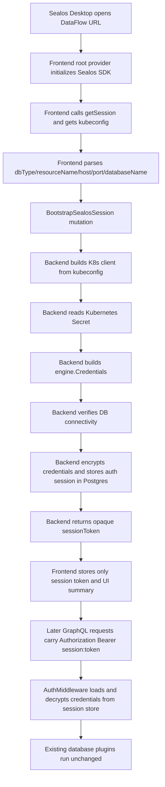
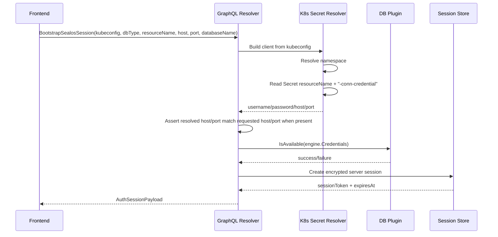

# DataFlow Sealos Kubeconfig Bootstrap and Server Session Design

**Date**: 2026-04-15  
**Status**: Proposed  
**Scope**: `dataflow/` frontend bootstrap, `core/` backend auth/session, Sealos Desktop startup integration  
**Supersedes**: the older "encoded credential in URL" bootstrap design

## 1. Summary

DataFlow will stop accepting encrypted database credentials from the startup URL.

The new Sealos flow is:

1. DataFlow frontend runs inside Sealos Desktop and obtains `session.kubeconfig`.
2. The startup URL carries only database bootstrap metadata such as `dbType`, `resourceName`, `host`, `port`, and `databaseName`.
3. Frontend sends `kubeconfig + bootstrap metadata` to a new backend bootstrap endpoint.
4. Backend uses `kubeconfig` to read the database Secret from Kubernetes, resolves the real database username/password, and verifies the connection.
5. Backend stores the resolved database credentials in a server-side session backed by Postgres.
6. Frontend keeps only an opaque `sessionToken` and uses it for all later requests.

This keeps DataFlow compatible with the Sealos/Desktop model already used by `dbprovider`, but removes the current requirement for the frontend to persist database username/password and resend them on every GraphQL request.

## 2. Why This Change Exists

The current bootstrap chain has two separate security and complexity problems:

1. Startup URL contains an encrypted `credential` blob that still represents real database credentials.
2. After login, frontend stores plaintext database credentials in memory and `sessionStorage`, then sends them in the `Authorization` header on every request.

That model creates avoidable exposure and couples the client directly to the database credential lifecycle.

The new design changes the trust boundary:

- Frontend may temporarily hold `kubeconfig`, consistent with Sealos `dbprovider`.
- Frontend no longer needs to hold database username/password after bootstrap.
- Backend becomes the owner of the active database session.

## 3. Design Goals

### 3.1 Goals

1. Remove `credential` from Sealos startup URLs.
2. Remove frontend-side persistence of database username/password in Sealos mode.
3. Reuse Sealos Desktop session access via `getSession()`.
4. Keep bootstrap simple enough to reason about and debug locally.
5. Preserve current database plugin behavior after credentials are resolved.
6. Use the existing Postgres-backed metadata infrastructure pattern for session persistence.
7. Allow incremental rollout with compatibility for existing login paths.

### 3.2 Non-Goals

1. Replacing all authentication flows in one step.
2. Changing database plugin connection semantics.
3. Introducing a general-purpose OAuth/session framework for the whole product.
4. Storing `kubeconfig` long term on the server.
5. Solving every upstream Sealos authorization policy concern inside DataFlow.

## 4. Key Assumptions

This design assumes the following upstream contract:

1. DataFlow is opened from Sealos Desktop, so frontend can call `sealosApp.getSession()`.
2. `session.kubeconfig` is available in the Sealos session object.
3. The provided `kubeconfig` is scoped enough for the current user or current resource.
4. The startup URL can provide a stable Kubernetes resource identifier, not only `host/port`.

If upstream cannot provide a stable resource identifier, DataFlow can temporarily infer resource lookup from existing fields, but that should be treated as transitional compatibility, not the final contract.

## 5. Current State

Today the Sealos-specific bootstrap path works roughly like this:

1. URL contains `dbType`, `credential`, `host`, `port`, `dbName`.
2. Frontend decrypts `credential` using `VITE_WHODB_AES_KEY`.
3. Frontend builds `LoginCredentials`.
4. Frontend calls `Login`.
5. Frontend stores resolved database credentials in `sessionStorage`.
6. Every later request sends the full credentials payload in `Authorization`.

This means the frontend remains the holder of the database secret for the entire session.

## 6. Target State

The target flow is:

1. URL contains only non-secret bootstrap metadata.
2. Frontend gets Sealos `session.kubeconfig`.
3. Frontend calls a new backend bootstrap mutation.
4. Backend resolves the real DB Secret from Kubernetes.
5. Backend verifies database connectivity.
6. Backend writes encrypted credentials into a Postgres-backed session store.
7. Frontend receives only `sessionToken` and metadata needed for UI display.
8. Every later request sends only the opaque `sessionToken`.

## 7. Architecture Overview



## 8. Startup URL Contract

### 8.1 Final URL Shape

The final Sealos startup URL should carry only bootstrap metadata:

```text
https://dataflow.example.com
  ?dbType=postgresql
  &resourceName=my-db
  &host=my-db-postgresql.ns-demo.svc
  &port=5432
  &databaseName=postgres
  &lang=zh
  &theme=dark
```

### 8.2 Parameter Definitions

| Param | Required | Meaning |
| --- | --- | --- |
| `dbType` | yes | Sealos/KubeBlocks database type |
| `resourceName` | yes | Kubernetes database resource name used to locate Secret |
| `host` | no | Expected DB host, used as an assertion |
| `port` | no | Expected DB port, used as an assertion |
| `databaseName` | no | Logical database name for the client session |
| `lang` | no | Frontend locale |
| `theme` | no | Frontend theme |

### 8.3 Transitional Compatibility

For rollout compatibility:

1. `dbName` may still be accepted as an alias for `databaseName`.
2. If `resourceName` is missing, backend may temporarily infer a resource identifier from legacy inputs.
3. `credential` will be ignored once the new flow is enabled.

## 9. Frontend Design

### 9.1 Root Sealos Provider

Frontend should add a single root Sealos provider/store responsible for:

1. calling `createSealosApp()`
2. fetching `getSession()`
3. fetching `getLanguage()`
4. exposing `session`, `language`, `loading`, and `isInSealosDesktop`
5. handling `EVENT_NAME.CHANGE_I18N`

This follows the same root integration pattern already documented in the local Sealos app builder references.

Frontend auth bootstrap in Sealos mode should wait for this root provider/store to finish its initial session load before deciding whether to call `BootstrapSealosSession`.

The same root provider/store must also propagate runtime language changes into the frontend i18n layer. Locale cannot be treated as a search-param-only boot value once `EVENT_NAME.CHANGE_I18N` is supported.

### 9.2 Bootstrap State

Frontend auth state in Sealos mode should change from database credentials to two persisted records:

```ts
type AuthSession = {
  sessionToken: string;
  type: string;
  hostname: string;
  port: string;
  database: string;
  displayName: string;
  expiresAt: string;
};

type BootstrapDescriptor = {
  dbType: string;
  resourceName: string;
  databaseName: string;
  host?: string;
  port?: string;
  namespace?: string;
  fingerprint: string;
};
```

`AuthSession` is the opaque authenticated session returned by the backend.

`BootstrapDescriptor` is not authentication state. It is the minimum non-secret bootstrap input the frontend must retain so it can bootstrap the same database target again after the URL params have been removed.

Frontend should no longer store:

1. `Username`
2. `Password`
3. inline `Advanced` credentials that came from bootstrap

### 9.3 Frontend Bootstrap Sequence

1. Parse URL search params.
2. If Sealos bootstrap params are present:
   1. load Sealos session
   2. get `session.kubeconfig`
   3. build `BootstrapDescriptor`
   4. call `BootstrapSealosSession`
   5. persist returned `AuthSession` together with `BootstrapDescriptor`
   6. remove bootstrap params from URL
3. If no Sealos bootstrap params are present:
   1. restore existing `AuthSession`
   2. restore existing `BootstrapDescriptor` when present
   3. continue normal rendering

On `401 Unauthorized` in Sealos mode:

1. frontend should discard the expired `AuthSession`
2. fetch a fresh Sealos `session.kubeconfig`
3. re-run bootstrap using the stored `BootstrapDescriptor`
4. replace the previous `AuthSession` only if rebootstrap succeeds

### 9.4 Frontend Request Model

All authenticated GraphQL requests should use:

```text
Authorization: Bearer session:<opaque-token>
```

If a request needs a database override, send it separately:

```text
X-WhoDB-Database: analytics
```

That removes the need to re-encode the entire credentials object for every request.

### 9.4.1 Frontend Session Retry Model

The frontend should handle expired or invalid DataFlow database sessions in a shared request layer such as the Apollo client error path.

Required behavior:

1. if a Sealos-mode request returns `401 Unauthorized`, frontend should attempt rebootstrap once
2. rebootstrap should use the stored `BootstrapDescriptor` plus a fresh Sealos `session.kubeconfig`
3. if rebootstrap succeeds, frontend should replay the failed request once
4. if rebootstrap fails, frontend should surface an auth/bootstrap error state
5. a single request must never trigger more than one automatic rebootstrap attempt

This retry behavior belongs in shared request plumbing, not in individual feature components.

### 9.4.2 Frontend Runtime I18n Model

Frontend locale resolution in Sealos mode should have two inputs:

1. initial locale from URL search params or Sealos `getLanguage()`
2. runtime locale updates from `EVENT_NAME.CHANGE_I18N`

The i18n provider must support changing locale after initial render so the app can respond to Sealos language changes without a full page reload.

### 9.5 Session Replacement Rules

Two different sessions exist in this design:

1. **Sealos Desktop session**
   - carries user identity and `kubeconfig`
   - usually remains stable while the same Sealos user is active
2. **DataFlow database session**
   - represents one resolved database target inside DataFlow
   - must be replaced when the bootstrap target changes

Frontend should compute and persist a bootstrap fingerprint as part of `BootstrapDescriptor`:

```text
<dbType>:<resourceName>:<host>:<port>:<databaseName>
```

Replacement behavior:

1. If a new bootstrap fingerprint differs from the stored fingerprint in the same tab, frontend must discard the current DataFlow session and run bootstrap again.
2. If only presentation params such as `lang` or `theme` change, frontend must keep the current DataFlow session.
3. If a second tab opens a different database target, that tab should create its own DataFlow session without mutating the first tab.

This means:

1. Sealos Desktop session usually stays the same.
2. DataFlow database session is scoped to one bootstrap target and changes when the target changes.

## 10. Backend Bootstrap Design

### 10.1 New GraphQL Mutation

Add a dedicated mutation for Sealos bootstrap instead of overloading `Login`.

```graphql
input SealosBootstrapInput {
  kubeconfig: String!
  dbType: String!
  resourceName: String!
  databaseName: String
  host: String
  port: String
  namespace: String
}

type AuthSessionPayload {
  sessionToken: String!
  expiresAt: String!
  type: String!
  hostname: String!
  port: String!
  database: String!
  displayName: String!
}

extend type Mutation {
  BootstrapSealosSession(input: SealosBootstrapInput!): AuthSessionPayload!
}
```

This mutation is public in the same sense that `Login` is currently public: it does not require an existing DataFlow session. It does, however, require a valid Sealos `kubeconfig` in the input.

Because the current backend auth gate uses an explicit allowlist of unauthenticated GraphQL operation names, implementation must add `BootstrapSealosSession` to that allowlist. Otherwise the request will be rejected before the bootstrap mutation can create a server session.

### 10.2 Backend Bootstrap Sequence



## 11. Kubernetes Secret Resolution

The backend should reuse the same Secret conventions already used by Sealos `dbprovider`.

### 11.1 Secret Naming

Default Secret name:

```text
<resourceName>-conn-credential
```

### 11.2 Key Mapping

The key mapping should be equivalent to the logic in Sealos `dbprovider`:

| dbType | username key | password key | host key | port key |
| --- | --- | --- | --- | --- |
| `postgresql` | `username` | `password` | `host` | `port` |
| `mongodb` | `username` | `password` | `host` | `port` |
| `apecloud-mysql` | `username` | `password` | `host` | `port` |
| `redis` | `username` | `password` | `host` | `port` |
| `clickhouse` | `username` | `password` | `host` | `port` |

### 11.3 Namespace Resolution

Namespace resolution order:

1. explicit `input.namespace`
2. current namespace from the kubeconfig context
3. fallback derived from the kubeconfig user if needed

This should intentionally match the current Sealos `dbprovider` behavior:

1. load the user kubeconfig from Sealos session data
2. prefer the namespace in the current kubeconfig context
3. if the kubeconfig context has no namespace, fall back to `ns-<current-user-name>`

### 11.4 dbprovider Compatibility Contract

Backend Sealos bootstrap should intentionally mirror the current `dbprovider` compatibility behavior for Kubernetes access and Secret parsing.

Required compatibility points:

1. kubeconfig loading must follow the same effective cluster resolution model used by `dbprovider`
2. namespace resolution must match `dbprovider` fallback semantics
3. Secret name must remain `<resourceName>-conn-credential`
4. Secret key mapping must remain aligned with `dbprovider`
5. resolved host normalization must match `dbprovider`

In particular, host normalization should use the same rule as `dbprovider`:

1. if Secret `host` already contains `.svc`, use it as-is
2. otherwise append `.<namespace>.svc`

This compatibility requirement exists so the same `resourceName` and same Sealos session produce the same effective Secret lookup and the same normalized `host` value in both `dbprovider` and DataFlow bootstrap.

### 11.5 Assertion Rules

If frontend sent `host` or `port`, backend must validate them against the Secret-derived values:

1. If `host` is present and does not match resolved host, fail bootstrap.
2. If `port` is present and does not match resolved port, fail bootstrap.

Host assertion must compare against the `dbprovider`-compatible normalized host value described above, not against an independently reformatted hostname.

This prevents accidental or inconsistent bootstrap state.

## 12. Server Session Store

### 12.1 Why a Server Session Exists

The server session is the key architectural change.

Without it, backend would still need to send database username/password back to the client or require `kc` on every later request.

The session store lets backend own the resolved DB credentials after bootstrap.

### 12.2 Storage Backend

Use the existing Postgres metadata-store pattern:

1. `WHODB_SESSION_DSN` if set
2. otherwise fallback to `WHODB_METADATA_DSN`

Implementation should follow the same `gorm + AutoMigrate + env DSN` pattern already used by `core/src/dashboard`.

This fallback is accepted for rollout. In phase 1, sharing the same Postgres instance between dashboard metadata and auth sessions is an acceptable default. Deployments that need stricter isolation may override it by setting `WHODB_SESSION_DSN` explicitly.

### 12.3 Table Shape

Recommended schema:

```sql
create table auth_sessions (
  id uuid primary key,
  token_hash text not null unique,
  source text not null,
  sealos_user_id text,
  k8s_username text,
  nsid text,
  namespace text not null,
  resource_name text,
  db_type text not null,
  host text not null,
  port text not null,
  database_name text not null,
  credentials_nonce bytea not null,
  credentials_ciphertext bytea not null,
  expires_at timestamptz not null,
  created_at timestamptz not null default now(),
  last_seen_at timestamptz not null default now(),
  revoked_at timestamptz
);
```

### 12.4 Storage Rules

1. Never store plaintext `sessionToken`.
2. Store `sha256(token)` as `token_hash`.
3. Encrypt the serialized `engine.Credentials` blob before storage.
4. Never store `kubeconfig`.
5. Support TTL-based cleanup.

### 12.5 Token Format

Raw client token:

```text
<random-opaque-token>
```

Request header:

```text
Authorization: Bearer session:<random-opaque-token>
```

The `session:` prefix makes the auth middleware route explicit and keeps rollout simpler while old inline-credentials auth still exists.

### 12.6 Session Scope

Each DataFlow server session is scoped to exactly one bootstrap target.

Implications:

1. a session created for database A must not silently be reused for database B
2. a same-tab bootstrap to a different target must replace the previous DataFlow session
3. backend may let the old session expire naturally, or may revoke it immediately after a successful replacement bootstrap

## 13. Session Encryption

Use AES-GCM with a dedicated server-side key:

- env var: `WHODB_SESSION_ENCRYPTION_KEY`
- key stored only on the backend

Encrypted payload should be the JSON form of:

```json
{
  "Type": "Postgres",
  "Hostname": "db.ns.svc",
  "Username": "postgres",
  "Password": "secret",
  "Database": "postgres",
  "Advanced": [
    { "Key": "Port", "Value": "5432" }
  ]
}
```

## 14. Auth Middleware Changes

The existing `AuthMiddleware` must support two auth modes during rollout:

1. new server session mode
2. old inline credentials mode

It must also keep a small unauthenticated allowlist for public GraphQL operations such as `Login`, `LoginWithProfile`, and `BootstrapSealosSession`.

### 14.1 New Flow

If `Authorization` starts with `Bearer session:`:

1. extract opaque token
2. compute `token_hash`
3. load session from Postgres
4. reject if expired or revoked
5. decrypt stored credentials
6. apply `X-WhoDB-Database` override when present
7. inject `engine.Credentials` into request context

### 14.2 Compatibility Flow

If `Authorization` does not use `session:`:

1. keep the current base64 credentials parsing logic
2. keep `Login` compatible for existing clients

This allows Sealos to migrate first without breaking manual login or legacy consumers.

## 15. Changes to Existing Login Semantics

### 15.1 Phase 1

Keep `Login(credentials)` as-is for manual and legacy flows.

Only Sealos bootstrap uses the new mutation and session store.

### 15.2 Phase 2

Optionally move manual login to the same server-session model:

1. user submits plaintext DB credentials once
2. backend validates connection
3. backend creates session store entry
4. frontend keeps only `sessionToken`

That phase is desirable, but not required for the Sealos migration.

## 16. Frontend File-Level Impact

Primary frontend files affected:

1. `dataflow/src/main.tsx`
   - ensure bootstrap waits on Sealos session initialization or renders a bootstrap loading state
   - mount the root Sealos bootstrap flow before auth-dependent rendering
2. `dataflow/src/stores/useAuthStore.ts`
   - replace `decryptSealosCredential` path with `BootstrapSealosSession`
3. `dataflow/src/config/auth-store.ts`
   - store `AuthSession` and `BootstrapDescriptor` instead of database credentials
4. `dataflow/src/config/auth-headers.ts`
   - emit `Bearer session:<token>`
5. `dataflow/src/config/graphql-client.ts`
   - perform one-shot `401` rebootstrap and request replay in shared request plumbing
6. `dataflow/src/config/sealos.ts`
   - remove AES decrypt logic
   - keep dbType mapping and bootstrap param parsing
7. `dataflow/src/i18n/I18nProvider.tsx`
   - support locale changes after initial render
8. `dataflow/src/i18n/url-params.ts`
   - remove `credential` from bootstrap key handling
   - add `resourceName` and `databaseName`
9. `dataflow/src/stores/useConnectionStore.ts`
   - derive display-only connection info from session summary
10. `dataflow/src/stores/useSealosStore.ts` or equivalent root Sealos provider/store
   - own `getSession()`, `getLanguage()`, and `CHANGE_I18N` subscriptions

## 17. Backend File-Level Impact

Primary backend files affected:

1. `core/graph/schema.graphqls`
   - add `SealosBootstrapInput` and `AuthSessionPayload`
   - add `BootstrapSealosSession`
2. `core/graph/schema.resolvers.go`
   - implement bootstrap resolver
3. `core/src/auth/auth.go`
   - support `session:` auth mode
   - treat `BootstrapSealosSession` as a public unauthenticated operation in the existing allowlist
4. `core/src/auth/login.go`
   - no immediate change required in phase 1
5. `core/src/session/`
   - new package for repository, crypto, models, service
6. `core/src/sealos/`
   - new package for kubeconfig parsing, K8s client setup, Secret resolution
7. `core/go.mod`
   - add Kubernetes client dependencies required by `core/src/sealos/`

## 17.1 Tooling and Dev File-Level Impact

Additional files affected for rollout and local verification:

1. `dev/generate-sealos-url.mjs`
   - stop generating encrypted `credential` for the new Sealos flow
   - emit `resourceName` and `databaseName` instead
2. `core/Dockerfile`
   - stop making the new bootstrap flow depend on `WHODB_AES_KEY`
   - keep any temporary legacy compatibility explicit during rollout
3. deployment or staging environment config
   - add `WHODB_SESSION_DSN`, `WHODB_SESSION_ENCRYPTION_KEY`, `WHODB_SESSION_TTL`, and `WHODB_SEALOS_BOOTSTRAP_ENABLED`

## 18. Environment Variables

Add:

| Env Var | Purpose |
| --- | --- |
| `WHODB_SESSION_DSN` | Postgres DSN for auth session storage |
| `WHODB_SESSION_ENCRYPTION_KEY` | AES-GCM key for stored DB credentials |
| `WHODB_SESSION_TTL` | Session lifetime (defaults to `24h`) |
| `WHODB_SEALOS_BOOTSTRAP_ENABLED` | Feature flag for the new Sealos bootstrap flow |

Deprecated after rollout:

| Env Var | Reason |
| --- | --- |
| `VITE_WHODB_AES_KEY` | no longer needed when URL does not carry encrypted DB credentials |

## 19. Error Handling

### 19.1 Bootstrap Errors

Return explicit bootstrap failures for:

1. missing or malformed `kubeconfig`
2. unsupported `dbType`
3. missing `resourceName`
4. Secret not found
5. Secret missing required fields
6. resolved host/port mismatch
7. database connectivity verification failure

### 19.2 Session Errors

Return `401 Unauthorized` when:

1. session token is invalid
2. session token is expired
3. session token is revoked

Frontend should treat `401` in Sealos mode as:

1. try bootstrap once again if Sealos session still exists
2. otherwise show an auth/bootstrap error state

The automatic retry should happen in shared request plumbing and must be limited to one retry per failed request.

## 20. Security Properties

This design improves security over the current flow in the following ways:

1. startup URL no longer contains database credentials, even encrypted
2. frontend no longer stores database username/password for the session lifetime
3. backend no longer trusts frontend to repeatedly provide live DB credentials
4. backend stores only encrypted credentials
5. server never stores `kubeconfig`
6. logs can be hardened around one opaque session identifier instead of a whole credentials payload

This design does **not** guarantee:

1. that upstream `kubeconfig` is perfectly scoped
2. that Sealos authorization policy is enforced entirely inside DataFlow

Those remain shared responsibilities between Sealos and DataFlow.

## 21. Rollout Plan

### Phase 0: Prepare

1. Add Sealos root provider on the frontend.
2. Add server session store package.
3. Add Kubernetes client dependencies and `core/src/sealos/`.
4. Add `BootstrapSealosSession`.
5. Add new auth middleware branch for `session:`.
6. Add staging and local environment wiring for `WHODB_SESSION_*` and `WHODB_SEALOS_BOOTSTRAP_ENABLED`.
7. Update local Sealos bootstrap tooling so the new flow can be exercised without encrypted URL credentials.

### Phase 1: Sealos Dual Stack

1. Keep old `Login(credentials)` flow.
2. Enable new Sealos bootstrap by feature flag.
3. Frontend Sealos path uses bootstrap mutation and server sessions.
4. Legacy paths continue using inline credentials.
5. Local and staging environments use the updated URL generator and session env wiring.
6. Container and build wiring must support the new flow without relying on `VITE_WHODB_AES_KEY`.

### Phase 2: Upstream URL Switch

1. Stop sending `credential` in startup URLs.
2. Start sending `resourceName` and `databaseName`.
3. Remove frontend AES decrypt path.
4. Keep rollback compatibility limited to the old login flow, not the old Sealos URL format.

### Phase 3: Cleanup

1. remove `credential` URL parsing
2. remove `VITE_WHODB_AES_KEY`
3. remove remaining legacy Docker/build wiring for AES URL credentials
4. update all Sealos docs and dev scripts
5. optionally migrate manual login to server sessions too

## 22. Testing Strategy

### 22.1 Backend Unit Tests

1. session token hashing
2. session crypto encrypt/decrypt roundtrip
3. session repository create/get/revoke/expire
4. auth middleware session branch
5. database override via `X-WhoDB-Database`
6. Secret resolution for supported db types
7. bootstrap resolver success/failure cases

### 22.2 Frontend Unit Tests

1. bootstrap param parsing
2. Sealos bootstrap mutation call path
3. auth store persistence with `AuthSession`
4. auth header construction with `session:`
5. expired session recovery behavior

### 22.3 Integration Tests

1. fake K8s Secret -> bootstrap -> session creation -> GraphQL query
2. invalid Secret -> bootstrap failure
3. expired session -> 401
4. host/port mismatch -> bootstrap failure

## 23. Open Items

These should be finalized before implementation starts:

1. Whether upstream startup URL can always provide `resourceName`.
2. Whether `host/port` should remain mandatory assertions or become optional diagnostics.

## 24. Recommendation

Proceed with this architecture and implement it in two steps:

1. Sealos bootstrap moves to `kubeconfig -> backend Secret lookup -> Postgres session`.
2. Legacy manual login remains unchanged until the Sealos path is stable.

That gives DataFlow a clean Sealos integration model, aligns with how Sealos `dbprovider` already acquires `kubeconfig`, and removes the current need for the frontend to retain and resend database plaintext credentials.
