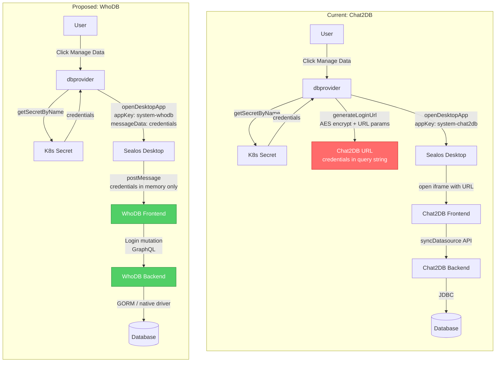
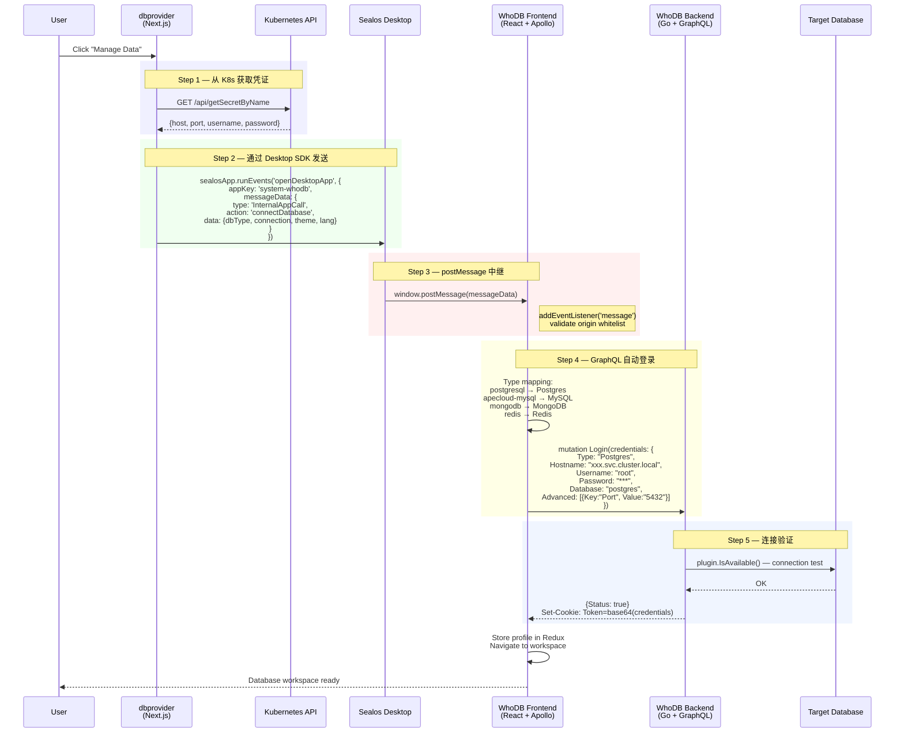
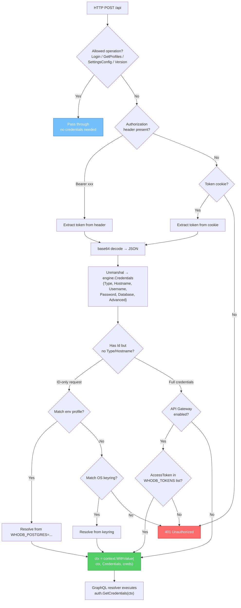
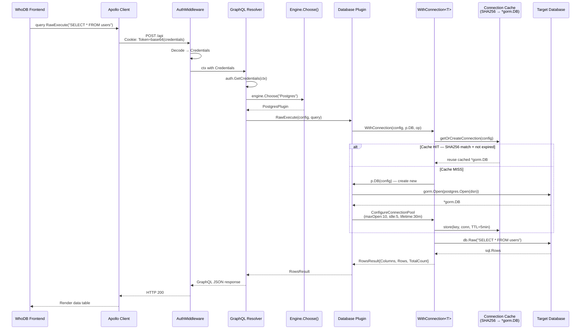
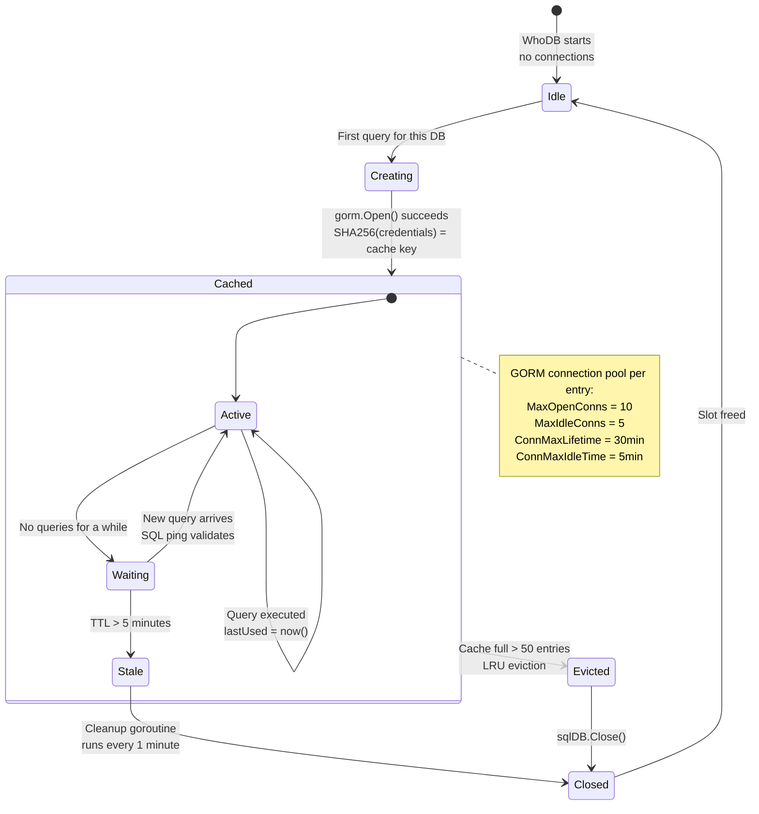
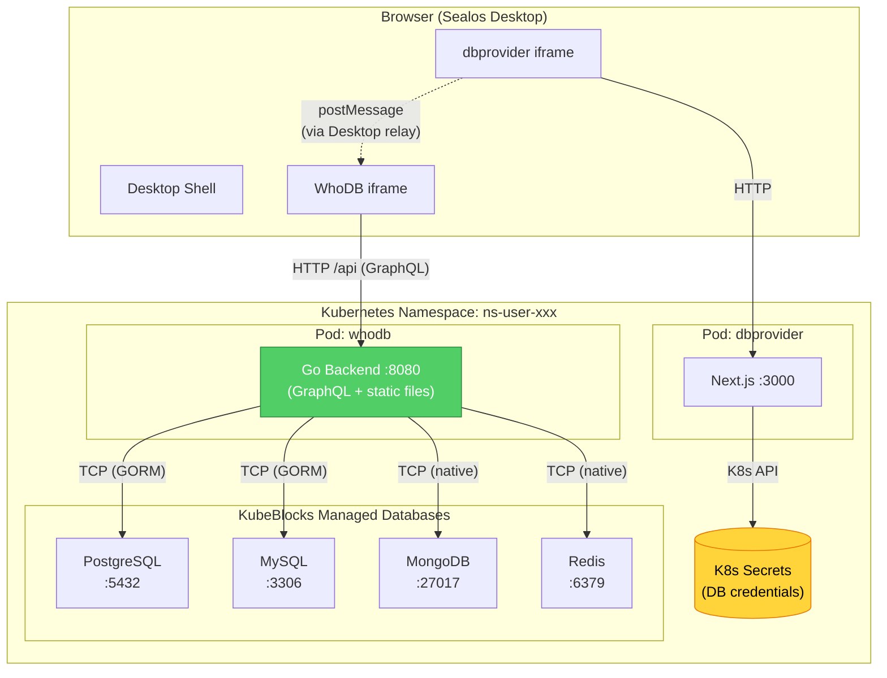
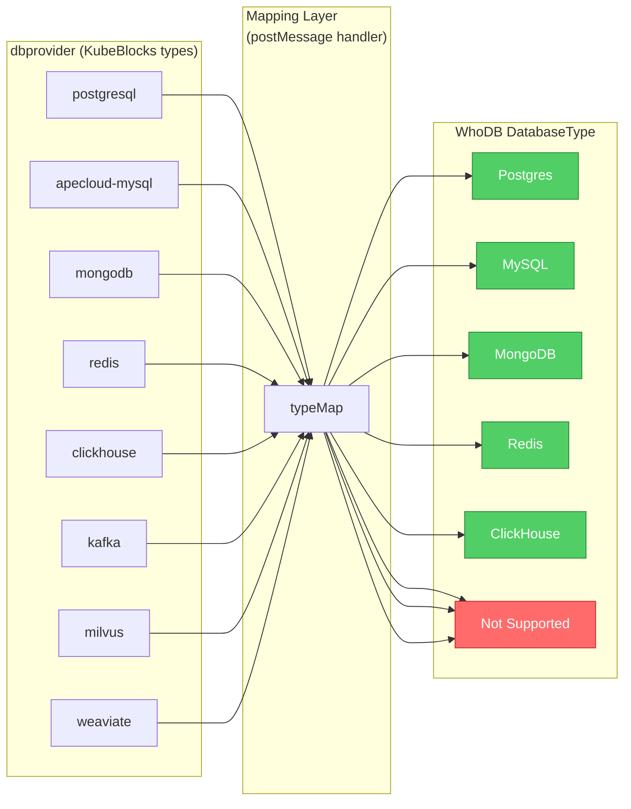
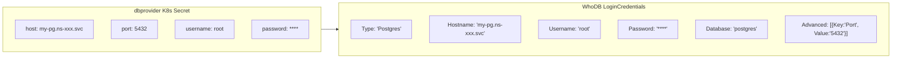

# WhoDB x Sealos 集成 — 数据流设计

> **Date:** 2026-03-23
> **Context:** 用定制 WhoDB 替代 DB Manager / Chat2DB 作为 dbprovider 的数据库客户端

---

## 1. 架构对比 — Chat2DB vs WhoDB

**关键差异:**
- Chat2DB: credentials 通过 URL query params + AES 加密（暴露在浏览器历史、Referer header、server logs）
- WhoDB: credentials 通过 `postMessage` 内存传递，never touches URL or logs
- Chat2DB: 需要额外的 datasource sync API 和独立后端
- WhoDB: 单容器（Go backend + static frontend），GraphQL 直连数据库

---

## 2. 凭证传递 — postMessage 完整时序

---

## 3. 认证中间件 — 每次请求的凭证解析

WhoDB 的 `AuthMiddleware` 在每个 GraphQL 请求中解析凭证并注入 context。

---

## 4. 查询执行 — Frontend → GraphQL → Plugin → Database

---

## 5. 连接缓存生命周期

---

## 6. Kubernetes 部署拓扑

**要点:**
- WhoDB 单容器部署，Go 后端既处理 GraphQL API 也 serve 静态前端
- 凭证不经过 WhoDB 磁盘，只在内存中（auth context + connection cache）
- 每个用户 namespace 一个 WhoDB 实例，天然隔离

---

## 7. 类型映射 — dbprovider → WhoDB

**凭证字段转换:**

---

## 8. 端到端完整路径

从用户点击按钮到执行 SQL 查询的完整数据流。

```mermaid
flowchart TB
    START(("User"))

    START -->|1| CLICK["Click 'Manage Data'<br/>on running DB instance"]
    CLICK -->|2| FETCH["dbprovider: GET /api/getSecretByName<br/>→ K8s API → Secret"]
    FETCH -->|3| BUILD["Build messageData:<br/>{type, action, data:{dbType, connection, theme, lang}}"]
    BUILD -->|4| SEND["sealosApp.runEvents('openDesktopApp',<br/>{appKey:'system-whodb', messageData})"]
    SEND -->|"5 — postMessage relay"| RECV["WhoDB: addEventListener('message')<br/>validate origin whitelist"]
    RECV -->|6| STORE["sessionStorage.setItem(<br/>'pendingConnection', JSON)"]
    STORE -->|7| MAP["Map types:<br/>postgresql→Postgres, apecloud-mysql→MySQL"]
    MAP -->|8| LOGIN["Auto-trigger: mutation Login({<br/>Type, Hostname, Username,<br/>Password, Database, Advanced})"]
    LOGIN -->|9| AUTH["AuthMiddleware: pass through<br/>(Login is in allowed list)"]
    AUTH -->|10| RESOLVE["Login resolver:<br/>engine.Choose(dbType)<br/>→ plugin.IsAvailable(credentials)"]
    RESOLVE -->|11| CONNECT["Plugin: gorm.Open(dsn)<br/>+ ConfigureConnectionPool"]
    CONNECT -->|12| TEST["Connection test:<br/>SELECT 1 / Ping"]
    TEST -->|"13 — success"| COOKIE["Response: {Status:true}<br/>Set-Cookie: Token=base64(creds)"]
    COOKIE -->|14| NAV["Frontend: dispatch login()<br/>navigate to workspace"]
    NAV -->|15| QUERY["User writes SQL or<br/>browses tables"]
    QUERY -->|16| EXEC["GraphQL with cookie →<br/>AuthMiddleware → Plugin →<br/>WithConnection → DB"]
    EXEC -->|17| RESULT(("Results rendered<br/>in WhoDB UI"))

    style START fill:#228be6,stroke:#1864ab,color:#fff
    style RESULT fill:#51cf66,stroke:#2b8a3e,color:#fff
    style SEND fill:#ffd43b,stroke:#e67700,color:#000
    style RECV fill:#ffd43b,stroke:#e67700,color:#000
    style LOGIN fill:#be4bdb,stroke:#862e9c,color:#fff
    style COOKIE fill:#be4bdb,stroke:#862e9c,color:#fff
```

---

## Diagram Index

| # | Diagram | 说明 |
|---|---------|------|
| 1 | Architecture Comparison | Chat2DB (URL+AES) vs WhoDB (postMessage) 安全性和架构差异 |
| 2 | Credential Delivery Sequence | postMessage 凭证传递完整时序，含 origin 验证 |
| 3 | Auth Middleware Flowchart | 每次 HTTP 请求的认证解析路径（cookie/header/profile/keyring）|
| 4 | Query Execution Sequence | 前端输入 → GraphQL → Plugin → 连接缓存 → DB 的完整数据通路 |
| 5 | Connection Cache Lifecycle | 连接缓存状态机：创建 → 活跃 → 空闲 → 过期/驱逐 → 关闭 |
| 6 | K8s Deployment Topology | WhoDB、dbprovider、DB pods 在 Sealos namespace 中的网络拓扑 |
| 7 | Type Mapping | KubeBlocks dbType → WhoDB DatabaseType 映射 + 凭证字段转换 |
| 8 | End-to-End Path | 用户从点击按钮到看到查询结果的 17 步完整路径 |
