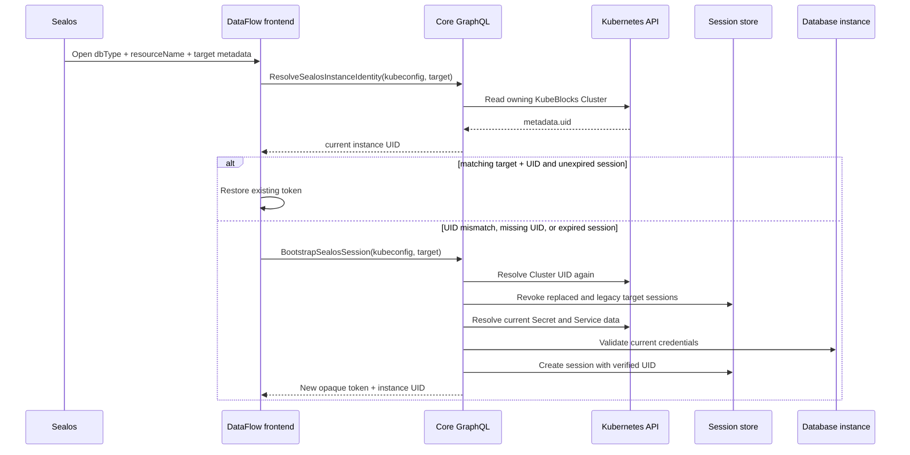

# Sealos Database Instance Session Identity

Status: Proposed  
Priority: High  
Scope: WhoDB Core and DataFlow frontend  
Decision record: [ADR 0005](../adr/0005-bind-sealos-sessions-to-database-instance-uid.md)  
Domain language: [CONTEXT.md](../../CONTEXT.md)

## 1. Executive Summary

**Problem Statement**: When a Sealos-managed database instance is deleted and a new instance is created with the same name, DataFlow can restore the previous server session because its bootstrap fingerprint contains only reusable target metadata. The restored session still contains credentials for the deleted instance, so the replacement instance fails authentication and remains unusable until the stale session is cleared or expires.

**Proposed Solution**: Bind every **Sealos Database Session** to the owning KubeBlocks `Cluster` object's Kubernetes UID. On each explicit Sealos launch, DataFlow resolves the current UID through a read-only GraphQL operation, reuses only an unexpired session with the same verified UID, and otherwise bootstraps a new session after revoking all sessions bound to the replaced UID and all matching legacy sessions without a UID.

**Success Criteria**:

- All five supported Sealos database engines pass an automated same-name replacement scenario in which the new instance receives a new session and its current credentials.
- An unexpired session is reused only when its stored instance UID matches the UID resolved for the explicit Sealos launch.
- After a UID mismatch is confirmed, zero unrevoked sessions remain for the replaced UID or for the same target with no stored UID.
- Failure to resolve the authoritative UID never falls back to resource name, endpoint, credentials, Secret UID, or `resourceVersion`.
- Frontend typecheck, build, and tests pass; backend tests and `go build ./...` pass.

## 2. User Experience & Functionality

### User Personas

- A Sealos user who opens a managed database instance in DataFlow.
- A database operator who deletes an instance and later creates another instance with the same name.
- A platform engineer responsible for the security and lifecycle correctness of DataFlow sessions.

### User Stories

#### Story 1: Open a replacement instance

As a Sealos user, I want DataFlow to recognize that a same-named database is a new instance so that it uses the replacement instance's current credentials.

Acceptance criteria:

- An explicit Sealos launch causes the backend to resolve the current owning KubeBlocks `Cluster` UID.
- If the stored session UID differs, DataFlow does not issue a database request with the old token.
- DataFlow bootstraps a new session using credentials resolved from the replacement instance.
- A successful replacement bootstrap reaches the normal database workspace without asking the user to clear browser storage or wait for session expiry.

#### Story 2: Reopen the same instance

As a Sealos user, I want DataFlow to reuse a valid session for the same instance so that reopening the database does not create unnecessary sessions or repeat database connectivity checks.

Acceptance criteria:

- DataFlow reuses the token only when the launch target matches, the stored UID equals the current UID, and `expiresAt` is in the future.
- Reuse does not call `BootstrapSealosSession`.
- A same-UID expired session follows the bootstrap path.

#### Story 3: Reject an unverifiable identity

As a platform engineer, I want DataFlow to fail closed when instance identity cannot be resolved so that reusable names or stale credentials cannot cross instance lifecycles.

Acceptance criteria:

- Kubernetes `Forbidden`, `NotFound`, discovery failure, and transport failure produce the localized bootstrap error state.
- The previous DataFlow session is not restored after identity resolution fails.
- No alternative identity source is used.

#### Story 4: Migrate existing sessions

As an existing DataFlow user, I want the new identity model to migrate safely without manual browser cleanup.

Acceptance criteria:

- A persisted Sealos session without an instance UID is treated as unverified.
- Its next explicit Sealos launch performs one new bootstrap.
- Bootstrap revokes all unrevoked legacy Sealos sessions for the same target before testing the new database connection.
- Standalone sessions are unchanged and do not require an instance UID.

### Non-Goals

- Polling the Kubernetes API from an already-open DataFlow page.
- Transparently moving SQL editor state, pending edits, or workspace tabs from a deleted instance to its replacement.
- Automatically recovering an old open page after database errors.
- Using database passwords, Secret UIDs, Service addresses, `resourceVersion`, or creation timestamps as instance identity.
- Modifying dbprovider to include a trusted instance UID in the startup URL.
- Storing Sealos kubeconfig in the server-side session database.
- Changing database plugin behavior or adding engine-specific identity branches.
- Changing standalone login or standalone session semantics.

## 3. AI System Requirements

Not applicable. This feature contains no AI model, prompt, evaluation, or tool-execution behavior.

## 4. Technical Specifications

### Architecture Overview

Kubernetes assigns an object UID that distinguishes object lifecycles even when a name is reused. The owning KubeBlocks `Cluster` UID is the authoritative **Database Instance Identity**; Kubernetes cluster scope is implicit to the in-cluster DataFlow deployment. See [Kubernetes Object Names and IDs](https://kubernetes.io/docs/concepts/overview/working-with-objects/names/).



The bootstrap resolver must resolve the UID again rather than accepting the probe result. If the instance is replaced between the probe and bootstrap, only the UID observed during bootstrap is stored with the new session.

### Integration Points

#### Kubernetes identity resolver

- Extend the Sealos resolver to read the `Cluster` custom resource named by `resourceName` in the resolved namespace.
- Resolve the served `clusters.apps.kubeblocks.io` resource through Kubernetes API discovery rather than branching by database engine.
- Return the `Cluster.metadata.uid` as a non-empty string.
- Keep the existing per-engine Secret and Service credential resolution unchanged.
- Do not fall back to dependent object metadata when Cluster lookup fails.

#### GraphQL contract

Add a public, read-only identity operation following the existing GraphQL-first architecture:

```graphql
input SealosInstanceIdentityInput {
  kubeconfig: String!
  resourceName: String!
  namespace: String
}

type SealosInstanceIdentity {
  uid: String!
  namespace: String!
  resourceName: String!
}

type Query {
  ResolveSealosInstanceIdentity(input: SealosInstanceIdentityInput!): SealosInstanceIdentity!
}
```

- Add `instanceUid: String` to `AuthSessionPayload`; it is non-null for Sealos sessions and null for standalone sessions.
- Add the identity query operation under `dataflow/src/graphql/queries/` and extend the existing bootstrap mutation selection with `instanceUid`.
- Regenerate both gqlgen server artifacts and frontend GraphQL artifacts.
- Add `ResolveSealosInstanceIdentity` to the public auth operation allowlist because it runs before a DataFlow session can be trusted.

#### Server session model and revocation

- Add nullable `InstanceUID` metadata to `session.AuthSession`; an empty value represents a legacy unverified session during migration.
- Add `InstanceUID` to `session.CreateParams` and populate it for Sealos bootstrap only.
- Add a repository/service operation that revokes unrevoked rows where:
  - `source = 'sealos'`;
  - `namespace` and `resource_name` match the current target; and
  - `instance_uid` is empty or differs from the UID resolved during bootstrap.
- Run revocation immediately after bootstrap confirms the current UID and before database availability is tested.
- Do not filter revocation by user: the replaced instance identity is invalid for every session.
- Do not revoke sessions for the current UID or any other target.
- Use parameterized GORM predicates only.
- Let the existing `AutoMigrate` path add the nullable column; no legacy row rewrite is required.

#### Frontend auth state

- Add nullable `instanceUid` to `AuthSessionSummary` so standalone sessions keep their current shape.
- Keep bootstrap target metadata separate from the resolved instance UID.
- Include `namespace` in the existing bootstrap target fingerprint so equal names in different namespaces cannot reuse a session.
- During `useAuthStore.initialize()` in Sealos context:
  1. initialize the Sealos SDK session and obtain kubeconfig;
  2. build the launch target descriptor;
  3. restore persisted auth state;
  4. call `ResolveSealosInstanceIdentity`;
  5. reuse only when target fingerprint, instance UID, and expiry all match;
  6. otherwise clear client auth state and call `BootstrapSealosSession`;
  7. persist the returned token and instance UID, then remove bootstrap parameters from the URL.
- A failed identity query sets auth status to `error` and must not restore the previous session.
- Use localization keys for all new user-visible errors; retain detailed causes for logs without exposing kubeconfig or credentials.
- Preserve the existing single shared rebootstrap behavior for expired sessions after initialization.

#### Primary implementation surfaces

- `core/src/sealos/resolver.go` and resolver tests.
- `core/src/session/models.go`, `crypto.go`, `repository.go`, `service.go`, and service tests.
- `core/graph/schema.graphqls`, `schema.resolvers.go`, auth middleware allowlist, and GraphQL resolver tests.
- `dataflow/src/config/auth-store.ts`.
- `dataflow/src/stores/useAuthStore.ts` and focused Sealos auth-store tests.
- Frontend GraphQL operations and generated types.
- English and Chinese locale YAML files if a new error message is introduced.

### Security & Privacy

- The frontend continues to persist only the opaque DataFlow token and non-secret connection summary metadata; it never persists kubeconfig or database credentials in `dataflow_auth`.
- Core continues to encrypt database credentials in the session store.
- The identity query receives kubeconfig under the same public bootstrap boundary as the existing bootstrap mutation and must not log it.
- UID comparison is an authorization reuse guard, not proof that database credentials are valid; bootstrap still validates the newly resolved credentials through the selected plugin.
- Revocation is scoped by the exact Sealos target and excludes the current UID to avoid invalidating unrelated sessions.

### Verification

Backend automated coverage:

- Resolve the owning Cluster UID for each supported `dbType` through the shared identity path.
- Return errors for missing Cluster, forbidden access, empty UID, and Kubernetes transport failure.
- Persist and round-trip `InstanceUID` in a created session.
- Revoke all old-UID and empty-UID sessions for the same target.
- Preserve current-UID sessions and sessions for other namespaces or resource names.
- Revoke stale sessions before a failing database availability check.
- Prove bootstrap stores the UID from its own second resolution.
- Confirm revoked tokens resolve as `ErrSessionRevoked` and produce HTTP 401 through auth middleware.

Frontend automated coverage:

- Same target, same UID, future expiry reuses the stored session without bootstrap.
- Same target, same UID, expired session bootstraps.
- Same target, different UID bootstraps and persists the replacement UID.
- Missing stored UID bootstraps once.
- Different namespace does not reuse the stored session.
- Identity query failure enters the error state and leaves no active auth session.
- Standalone restore and login tests remain unchanged.

Manual cluster coverage:

1. For PostgreSQL, MySQL, MongoDB, Redis, and ClickHouse, open the instance in DataFlow and record successful access.
2. Delete the instance and create a new instance with the same name.
3. Open the replacement from Sealos without clearing browser storage.
4. Confirm DataFlow opens successfully with the replacement credentials.
5. Confirm an old token for the replaced UID receives HTTP 401.

Required repository verification:

```bash
cd dataflow && pnpm run generate
cd dataflow && pnpm run typecheck
cd dataflow && pnpm run test
cd dataflow && pnpm run build
cd core && go generate ./...
cd core && go test ./...
cd core && go build ./...
```

## 5. Risks & Roadmap

### Phased Rollout

- **MVP**: Ship the schema migration, Kubernetes identity resolver, identity GraphQL query, stale-session revocation, frontend comparison flow, localization, and automated coverage in one compatible release. Backend must deploy before or together with the generated frontend that calls the new query.
- **v1.1**: No functional expansion is committed. If existing telemetry infrastructure supports it without recording sensitive data, track identity lookup failures and replacement bootstraps by database type.
- **v2.0**: No scope is committed. Active-page lifecycle events or server-pushed instance invalidation remain separate future work.

### Technical Risks

- **Kubernetes RBAC**: User kubeconfig may read Secrets but not the KubeBlocks Cluster CR. This feature intentionally fails closed; deployment permissions must be validated before rollout.
- **CRD discovery**: KubeBlocks API versions can differ between clusters. Resolve the served Cluster resource through discovery and test against supported Sealos environments.
- **Migration ordering**: A new frontend cannot call the identity query against an old backend. Coordinate deployment ordering or image versioning.
- **Revocation scope**: An overly broad predicate could revoke unrelated sessions. Repository tests must prove namespace, resource name, source, and UID isolation.
- **Bootstrap race**: The instance can change after the initial identity probe. Bootstrap's independent UID resolution is mandatory.
- **New instance readiness**: A confirmed replacement may not yet accept database connections. Old sessions remain revoked and the localized bootstrap error is shown until a later explicit retry.
